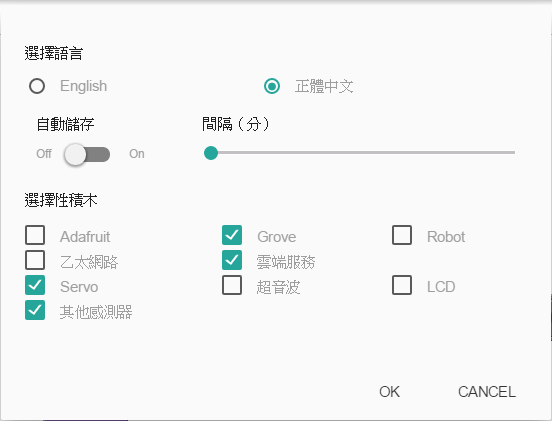
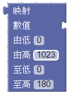
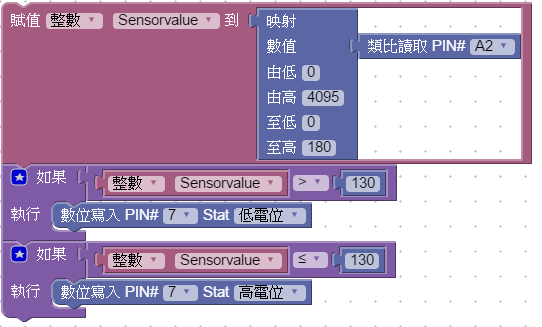
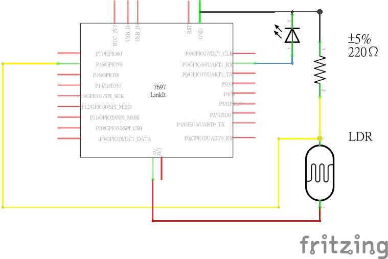

# EXAMPLE: Light Sensor with blink
**註：本文中所使用的 Block ，其功能將以正體中文為示例主語言**

## 給使用者/開發者的注意事項
1. 在BloclyDuino，若您想要取用一個新的自定義變數，**您只需要將 "Item" 變數項重新命名**即可。
- 而下一次您需要其他的新變數時，系統將會自動建立一個新的 "Item" 供使用者自定義。
2. 對於曾使用 Arduino IDE 開發過的您，您可能需要知道：
- Void loop 的部分不需要另作宣告。
- 除 **加入Setup** 下的子 Block 外的 Block ，將會自動併入 Void loop 當中。

3. 如果您找不到您需要的分類項，請點右上角的齒輪按鈕，並在 "選擇性積木" 中點擊您需要的分類。
- 當您點擊成功，您應該會看到：



## 閱讀下文示例的您應該注意的幾件事：
- <> 代表著您可能需要在此括號中填入指定的資料。
- 例如：
- 假如本文章在某個環節需要您運用上圖的 Block ，將會用「 延遲 **< 資料 >** 」來告知您，意味著您需要在 **< 資料 >** 項填入您需要的數據，或**任何可供該 Block 運用的資訊**。
- 關於 BlockyDuino 的**分類項** ：
- 

- 本文在 Block 示例時，將會告知您需要在哪個分類項找到您可能會使用到的 Block.
- 如果您有需要自定義接腳，請參照下圖的pinout(接腳圖)：
- 
- 高解析度檔案： https://labs.mediatek.com/en/download/1ega2lbl

# EXAMPLE : Light Sensor
## 您將在本例子使用的分類項 & Block
### 邏輯
- 如果 < 事件 > 執行 < 事件 >
    - 
### 數學
- < 數字 >
    - 
- 映射數值 由低< 數字 > 由高< 數字 > 至低< 數字 > 至高< 數字 >
    - 
### 變數
- 賦值 < 資料型態 > < 變數 > 到 < 資料 >
    - 
- <資料型態> <變數>
    - 
### 初始化
- 加入 Setup()
    - 
### 輸入/輸出 → 數位
- 數位寫入 PIN# < 腳位 > Stat < 邏輯電位 >
    - 
- Stat = Status
### 輸入/輸出 → 類比
- 類比讀取 PIN# < 腳位 >
    - 
## Demo (實際示例)

燒入上圖的 Block 所生成的程式，您將可以利用光敏電阻所量測到的電位，來作為偵測周遭光源的訊號，並看到 Linkit 7697 的內建LED燈訊號及外部所並接的 LED燈 的變化。
### 測試用線路：

#### 測試元件：
- Linkit 7697
- 5mm LED
- 光敏電阻 (LDR) 
- 碳膜電阻 220 ohm
=======
### 測試線路：


## Workflow (工作流程)
### Software
1. 「賦值　< 資料型態 > < 變數 > 到 < 資料 >」將映射後的的資料送入變數 (Sensorvalue) 當中
- 類比接腳 (本範例使用 A2 接腳) 讀入從「類比讀取 PIN# < 腳位 >」得到的類比數值。
- 讀取完畢後得到的一連串資料將會是0~4095的數值，這一連串的數值的誤差變化量非常大，故我們需要將資料進行縮放，使誤差變小以便做判斷。
- 最後映射完畢後，將產生的值丟回變數「Sensorvalue」當中做下一步處理。
2. 「如果 < 事件 > 執行 < 事件 >」做環境光源是否夠亮的邏輯判斷
- 如果 < Sensorvalue 大於130 > 則 < 數位寫入 PIN#7 低電位 >
- 光敏電阻的特性：電阻值跟光源亮度成反比，光源越亮電阻值越小。利用此特性，當亮度足夠亮的時候，電阻值變小，則意味著類比接腳所能讀入的電壓： (Sensorvalue) 的值會變大。
- 此時「數位寫入 PIN# < 7 > Stat < 低電位 >」，低電位意近於沒有電壓，因此便能把 LED 燈熄滅。
3. 下一個「如果 < 事件 > 執行 < 事件 >」則做環境光源是否夠暗的邏輯判斷
- 如果足夠暗，便把 LED 燈點亮。
4. 回到1. 進行循環。

### Hardware

線路的顏色分別代表：
- 黃色 (Yellow):Pin 16 = A2
    - 詳情請看本文章開頭的Pinout
- 紅色 (Red):5V
- 藍色線 (Blue):Pin 7
- 黑色線 (Black):GND

假如 LDR 的電阻很小 (外部燈光非常明亮)，根據分壓定則，
V_PIN13 =[ 220/(LDR + 220) ] * 5V 
則 A2 會得到接近5V的電壓。
反之，LDR 的電阻變得很大的時候 (周遭沒有光源)，
A2的電壓將會接近 0V = GND。

## Additional (額外補充)
1. Linkit 7697 的內建 LED 燈，上面寫著 USR 三個字。
2. **Linkit 7697的內建 LED 燈和 PIN 7 在板子內部的線路並聯的**
下例是 Arduino IDE 的版本：

```arduino=
int Sensorvalue;

void setup()
{
    pinMode(7, OUTPUT);
}

void loop()
{
    Sensorvalue = (map(analogRead(A2),0,4095,0,180));
    if (Sensorvalue > 130) {
    digitalWrite(7, LOW);
    }
    if (Sensorvalue <= 130) {
    digitalWrite(7, HIGH);
    }
}
```